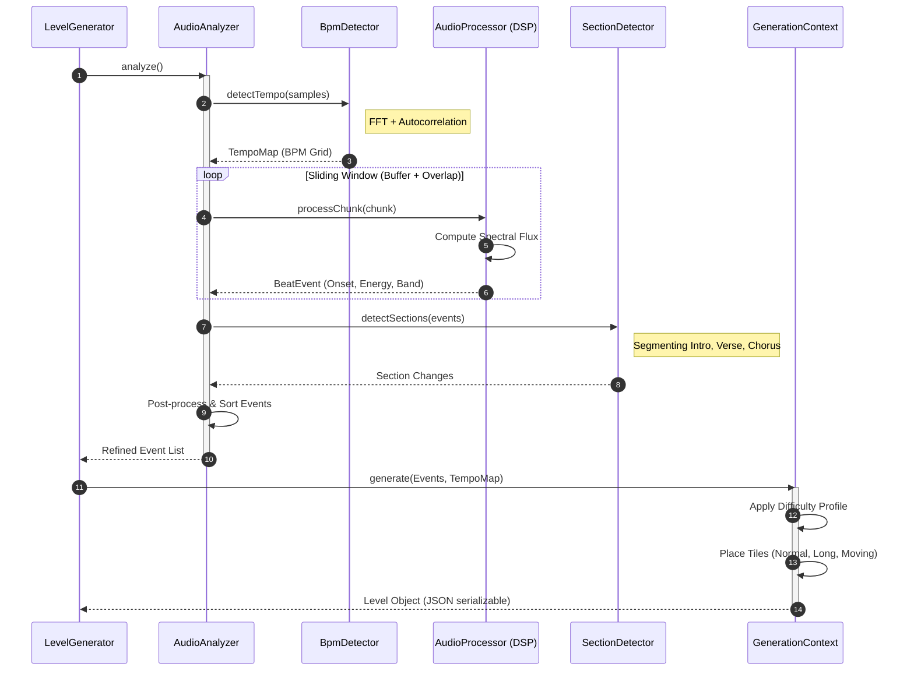

# BeatBounce

BeatBounce is a dynamic rhythm game developed in Java. It features procedural level generation based on audio analysis, allowing players to experience their favorite music in a unique, interactive way.

---

## 🚀 Features

- **Procedural Level Generation**: Levels are automatically created by analyzing audio tracks (BPM, onsets, frequency bands).
- **Audius API Integration**: Search and stream/download music directly from the [Audius](https://audius.co/) platform.
- **Advanced Audio Analysis**: Utilizes DSP (Digital Signal Processing) with TarsosDSP for accurate beat detection.
- **High Performance Rendering**: Optimized Java Swing GUI with support for High DPI and hardware acceleration (OpenGL/Direct3D).
- **Customizable Experience**: Various tile types (Normal, Moving, Breakable, Long), difficulty profiles, and visual settings.
- **Achievement System**: Track your progress and unlock achievements as you play.
- **Local Music Support**: Play your own MP3, OGG, or FLAC files.

---

## 🛠 Tech Stack

- **Language**: Java 25
- **Build System**: Maven
- **GUI Framework**: Java Swing (Custom components)
- **Audio Processing**: TarsosDSP, MP3SPI, VorbisSPI, JFLAC
- **JSON Processing**: Jackson Databind
- **Testing**: JUnit 5, Mockito

---

## 🏗 Architecture & Data Flow

BeatBounce relies on complex data pipelines to synchronize visual gameplay with audio processing.

### 🎼 Audio Analysis Pipeline

This sequence captures the multi-stage DSP pipeline used to transform raw PCM samples into a procedurally generated level.



### 🎮 Game Execution

The following diagram illustrates the high-precision update loop executed for every frame to maintain synchronization and handle physics.


---

## 📋 Prerequisites

- **Java Development Kit (JDK) 25** or higher.
- **Maven** for building the project.

---

## ⚙️ Installation & Running

1. **Clone the repository:**
   ```bash
   git clone https://github.com/your-username/BeatBounce.git
   cd BeatBounce
   ```

2. **Build the project:**
   ```bash
   mvn clean package
   ```

3. **Run the application:**
   ```bash
   java -jar target/cz.matysekxx.beatbounce-1.0-SNAPSHOT.jar
   ```

---

## 🎮 How to Play

1. **Select a Song**: Choose a song from the Audius library or load a local file.
2. **Analysis**: The game will analyze the song and generate a level.
3. **Gameplay**: Control the sphere to bounce on tiles in sync with the beat. Use your mouse or keyboard (configurable) to navigate.
4. **Collect Orbs**: Pick up orbs for extra points.

---
