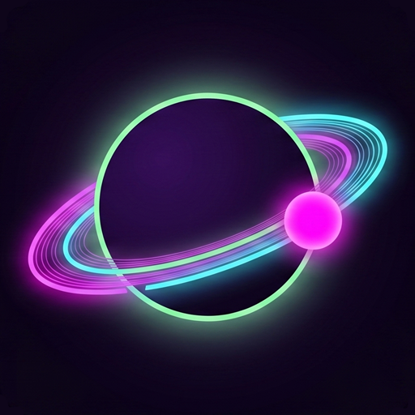
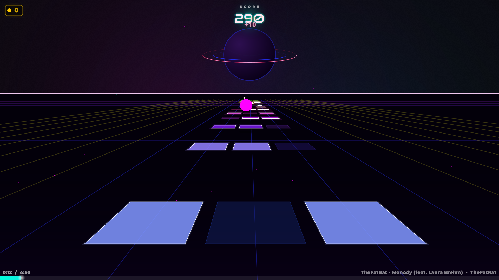
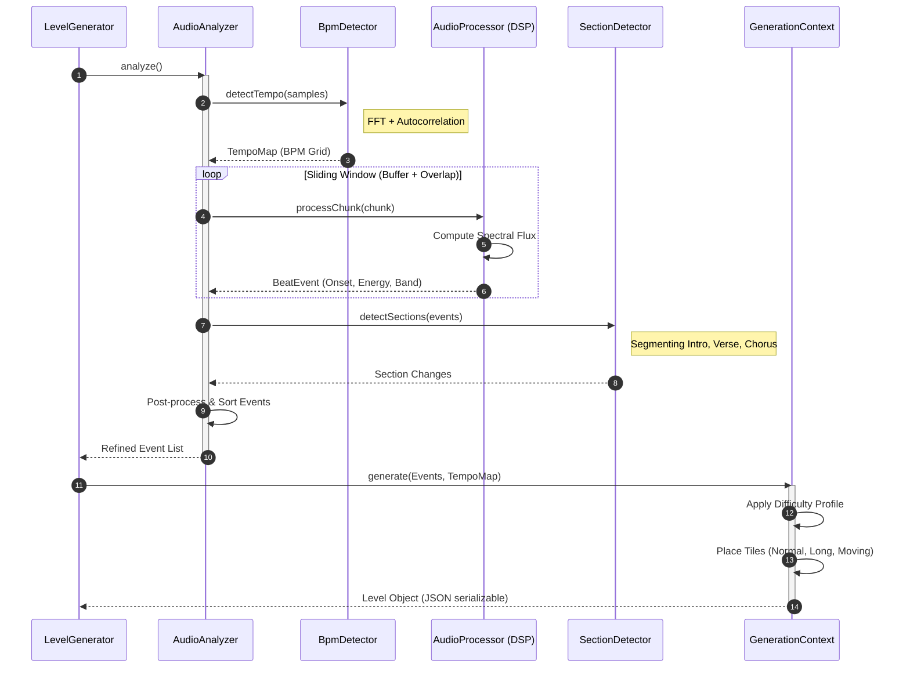
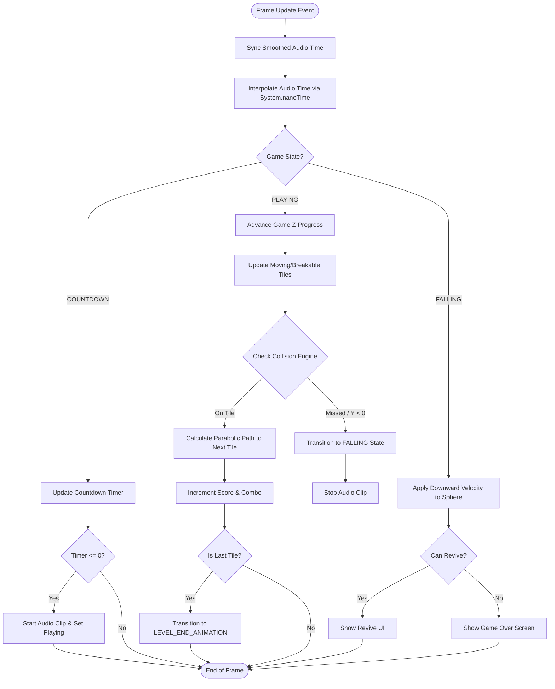

<div align="center">
  
  <h1>BeatBounce</h1>
  <p>A dynamic, procedurally-generated rhythm game built in Java.</p>

[](https://www.oracle.com/java/)
[](https://maven.apache.org/)
[](#)
</div>

---

BeatBounce is a high-performance rhythm game developed in Java. By combining real-time Digital Signal Processing (DSP)
with procedural generation, it transforms any audio track into a unique interactive experience. Players navigate a
sphere through a 3D-projected environment, timing their movements to the detected beats and frequency shifts of the
music.

<br>
<div align="center">
  
  <br>
</div>

<br>

---

## 🚀 Key Features

- **🎹 Intelligent Level Generation**: Automatically maps level geometry to BPM, spectral flux, and detected song
  sections (Intro, Chorus, etc.).
- **🎵 Audius Integration**: Stream and analyze millions of tracks directly from the
  decentralized [Audius](https://audius.co/) network.
- **⚡ High-Performance Rendering**: Custom-built Swing-based engine with hardware acceleration (OpenGL/Direct3D) and
  High DPI support.
- **🏆 Progression & Achievements**: Dynamic scoring system with combo multipliers, global high scores, and unlockable
  achievements.
- **🎧 Broad Format Support**: Native support for MP3, OGG, and FLAC via specialized SPI providers.

---

## 🛠 Tech Stack

| Category         | Technology                              |
|:-----------------|:----------------------------------------|
| **Language**     | Java 25                                 |
| **Build Tool**   | Maven 3.9+                              |
| **Audio Engine** | TarsosDSP, MP3SPI, VorbisSPI, JFLAC     |
| **Graphics**     | Java Swing (Custom 2D-to-3D projection) |
| **Data**         | Jackson Databind (JSON)                 |
| **Testing**      | JUnit 5, Mockito                        |

---

## 🏗 Architecture & Data Flow

BeatBounce utilizes a modular architecture to decouple high-latency audio analysis from the low-latency game loop.

### 🎼 Audio Analysis Pipeline

The analysis occurs in a separate thread pool to prevent UI blocking, using a multi-pass approach to identify musical
structures.



### 🎮 Game Execution (Activity Loop)

The game engine synchronizes visual updates with the audio timestamp using `System.nanoTime()` for micro-second
precision.



---

## 📂 Project Structure

```text
src
+---main
|   +---java
|   |   \---cz.matysekxx.beatbounce
|   |       +---achievements  # Logic for unlockable milestones
|   |       +---api           # Audius Discovery Provider integration
|   |       +---configuration # App-wide settings and hardware tweaks
|   |       +---controller    # Input handling (Keyboard/Mouse)
|   |       +---gui           # Custom-rendered Swing screens and components
|   |       +---model         # Domain logic: Audio DSP, Entities, Game Engine
|   |       \---util          # Mathematical helpers and scaling utilities
|   \---resources             # Static assets: MP3s, icons, level metadata
\---test                      # Comprehensive unit tests (JUnit 5)
```

---

## ⚙️ Installation & Running

### Prerequisites

- **JDK 25+** (Required for the latest language features)
- **Maven 3.9+**

### Steps

1. **Build:** `mvn clean package`
2. **Run:** `java -jar target/cz.matysekxx.beatbounce-1.0-SNAPSHOT.jar`

---
